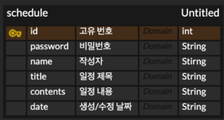

# Calendar

### API 명세서
| 기능       | Method | URL                     | request | response | 상태코드              |
|----------|--------|-------------------------|---------|----------|-------------------|
| 일정 생성    | POST   | /calendar               | 요청 body | 등록 정보    | 200 정상 등록, 400 실패 |
| 전체 일정 조회 | GET    | /calendar               |         | 다건 응답 정보 | 200 정상 조회, 400 실패 |
| 선택 일정 조회 | GET    | /calendar/{schedule_id} |         | 단건 응답 정보 | 200 정상 조회, 400 실패 |
| 선택 일정 수정 | PATCH  | /calendar/{schedule_id} | 요청 body | 수정 정보    | 200 정상 수정, 400 실패 |
| 선택 일정 삭제 | DELETE | /calendar/{schedule_id} | 요청 body |          | 200 정상 삭제, 400 실패 |


#### 1. 일정 생성
/calendar
+ Request
  + Header : Content-Type:application/json
  + Body :

```
{
    "name": "작성자",
    "password": "비밀번호",
    "title": "제목",
    "contents": "내용"
}
```

  | 이름       | 타입     | 설명    | 필수 | 
  |----------|--------|-------|----|
  | name     | String | 작성자명  | O  |
  | password | String | 비밀번호  | O  |
  | title    | String | 일정 제목 | O  |
  | contents | String | 일정 내용 | X  |

+ Response
  + Body :

```
{
    "id": "아이디",
    "name": "작성자",
    "title": "제목",
    "date": "YYYY-MM-DD HH:mm:ss"
}
```
  
  | 이름    | 타입     | 설명      |
  |-------|--------|---------|
  | id    | int    | 일정 고유번호 |
  | name  | String | 작성자명    |
  | title | String | 일정 제목   |      
  | date  | String | 생성 일시   |   


#### 2. 전체 일정 조회
/calendar
+ Request
  + Parameters :
  
  | 이름   | 타입     | 설명           | 필수 | 
  |------|--------|--------------|----|
  | name | String | 작성자          | X  |      
  | date | String | 조회할 생성/수정 일자 | X  |      


+ Response
  + Body :

```
{
    "id": "아이디",
    "name": "작성자",
    "title": "제목",
    "date": "YYYY-MM-DD HH:mm:ss"
}
```
  
  | 이름    | 타입     | 설명       |
  |-------|--------|----------|
  | id    | int    | 일정 고유번호  |
  | title | String | 일정 제목    |
  | name  | String | 작성자      |
  | date  | String | 생성/수정 일자 |


#### 3. 선택 일정 조회
/calendar/{schedule_id}

+ Request

+ Response
  + Body :

```
{
    "name": "작성자",
    "title": "제목",
    "contents": "제목",
    "date": "YYYY-MM-DD HH:mm:ss"
}
```

  | 이름       | 타입     | 설명       |
  |----------|--------|----------|
  | name     | String | 작성자      |
  | title    | String | 일정 제목    |
  | contents | String | 일정 내용    |
  | date     | String | 생성/수정 일시 |


#### 4. 선택 일정 수정
/calendar/{schedule_id}

+ Request
  + Parameters :
  
  | 이름       | 타입     | 설명     | 필수 | 
  |----------|--------|--------|----|
  | name     | String | 작성자명   | X  |      
  | password | String | 비밀번호   | O  |      
  | contents | String | 수정할 내용 | X  |      


#### 5. 선택 일정 삭제
/calendar/{schedule_id}

+ Request
  + Parameters :

  | 이름          | 타입     | 설명        | 필수 | 
  |-------------|--------|-----------|----|
  | password    | String | 비밀번호      | O  |      


#### ERD
